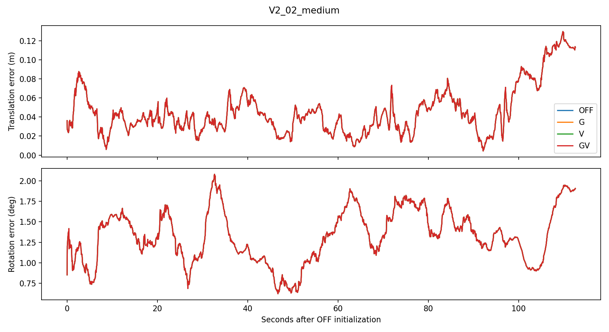
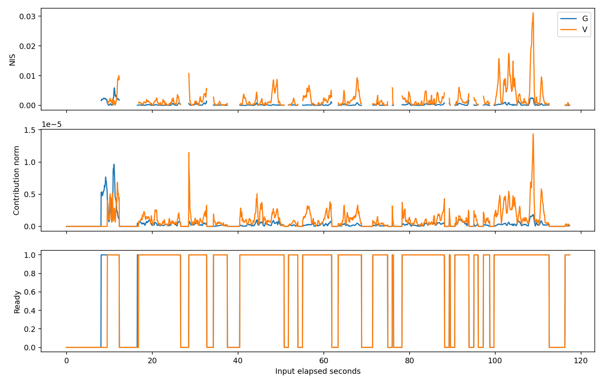
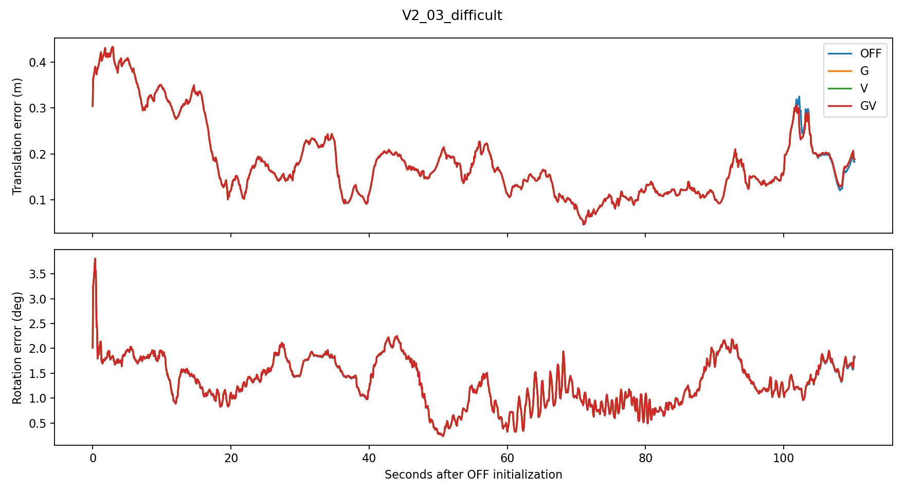
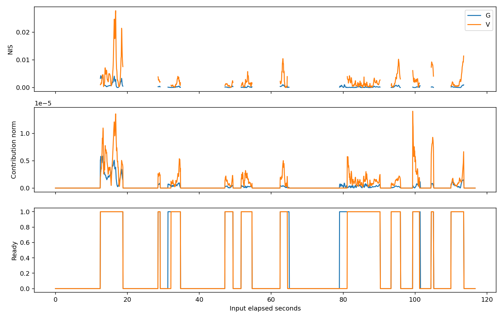

# G/V 融合评测收尾

冻结基线 83c71cbc585123381f033c8dbcd625c14e8e7fac。

工程验证：通过。实际 ROS/colcon 构建及 24 个相关原生测试完成；十二次完整真实回放及预算记录见 evidence。
生产 G/V 默认关闭。所有配置未调参。收益、工程有效性和统计一致性分开判断。

**收益结论：没有明确收益证据。** GV 在 V2_02 的 ATE 微增约0.00345%，在 V2_03 微降约0.08870%；绝对变化分别约+0.00179mm和−0.18398mm。变化很小且方向不一致，确定性重复不提供独立统计样本。RPE 的细微变化全部保留在表中，未据此调参。**统计一致性：证据不足。**

| 序列 | 模式 | ATE m | 1s RPE m / deg | 5s RPE m / deg | 覆盖 / 样本 | 实际 G / V 更新 |
|---|---|---:|---|---|---|---|
| V2_02_medium | OFF | 0.051975 | 0.024284 / 0.300205 | 0.049302 / 0.915869 | 100.00% / 2252 | 0 / 0 |
| V2_02_medium | G | 0.051978 | 0.024283 / 0.300085 | 0.049300 / 0.915771 | 100.00% / 2252 | 1606 / 0 |
| V2_02_medium | V | 0.051973 | 0.024282 / 0.300200 | 0.049301 / 0.915857 | 100.00% / 2252 | 0 / 1571 |
| V2_02_medium | GV | 0.051977 | 0.024281 / 0.300081 | 0.049299 / 0.915761 | 100.00% / 2252 | 1606 / 1571 |
| V2_03_difficult | OFF | 0.207428 | 0.044782 / 0.453368 | 0.098826 / 0.968568 | 100.00% / 1799 | 0 / 0 |
| V2_03_difficult | G | 0.207245 | 0.044516 / 0.453116 | 0.098145 / 0.968272 | 100.00% / 1799 | 706 / 0 |
| V2_03_difficult | V | 0.207235 | 0.044513 / 0.453089 | 0.098136 / 0.968198 | 100.00% / 1799 | 0 / 637 |
| V2_03_difficult | GV | 0.207244 | 0.044514 / 0.453081 | 0.098140 / 0.968170 | 100.00% / 1799 | 706 / 637 |

本轮共 28 次真实回放进程启动，20 次完整成功，8 次早期工具失败。原预算从38次真实回放增加到66次。所有失败、修复和重验均留档。
八次 G/V 早期启动在两轮中被配置校验和 observer 构造器内的旧 Passive 注入断言拦截，未读取传感器输入。完整检索并将配置、adapter、manager 中全部仅 Passive 注入断言接入同一仪器开关，保留其他校验。两次修复各以新目录重跑两序列原 Passive 与融合 OFF，最终执行 G/V/GV 和重复。
编译时诊断结构补充与 UpdaterLTV 对象编译重叠，曾导致空视觉行计数测试失败；显式重编译该对象后24测试通过。修复配置断言后重新构建、24测试再次通过。首次沙箱构建在子进程退出后等待停滞而中断；所有构建尝试/原生测试/评价器自测日志保留。没有按误差调参。

原 Passive OFF 对已有冻结 OFF、新工具 OFF 对原 Passive 的逐字段/逐字节比较均保留在 parity 文件；只排除既有顶层 compute_time_ms。GV 重复的主状态、完整 P 摘要、完整 LTV x/P/输入缓存、生命周期、Consistency、readiness、融合事件和原始矩阵要求精确一致，见 repeat 文件。

仪器差异：原 Passive 保留零注入断言；融合工具关闭该断言并启用只读完整矩阵捕获，OFF/G/V/GV 覆盖相同。详细数学/相关性/异常合同见 [update_contract.md](update_contract.md)。

## V2_02_medium

| 模式 | 相对 OFF ATE 变化 | 首次主均值 / P / LTV 分歧时间 ns | 首次主分歧对应实际融合 |
|---|---:|---|---|
| G | +0.006% | 1413393894105760512 / 1413393894105760512 / 1413393894155760384 | True |
| V | -0.004% | 1413393895555760384 / 1413393895555760384 / 1413393895605760512 | True |
| GV | +0.003% | 1413393894105760512 / 1413393894105760512 / 1413393894155760384 | True |

G-only/V-only/OFF 全时间事件曲线分别见 [V2_02_medium_G_events.png](V2_02_medium_G_events.png)、[V2_02_medium_V_events.png](V2_02_medium_V_events.png)、[V2_02_medium_OFF_events.png](V2_02_medium_OFF_events.png)。

## V2_03_difficult

| 模式 | 相对 OFF ATE 变化 | 首次主均值 / P / LTV 分歧时间 ns | 首次主分歧对应实际融合 |
|---|---:|---|---|
| G | -0.088% | 1413394894105760512 / 1413394894105760512 / 1413394894155760384 | True |
| V | -0.093% | 1413394894105760512 / 1413394894105760512 / 1413394894155760384 | True |
| GV | -0.089% | 1413394894105760512 / 1413394894105760512 / 1413394894155760384 | True |

G-only/V-only/OFF 全时间事件曲线分别见 [V2_03_difficult_G_events.png](V2_03_difficult_G_events.png)、[V2_03_difficult_V_events.png](V2_03_difficult_V_events.png)、[V2_03_difficult_OFF_events.png](V2_03_difficult_OFF_events.png)。

## 证据和边界

独立原始矩阵复核见 [matrix_audit.json](matrix_audit.json)：检查 9144 次实际联合 EKF 更新（含 GV 重复），完整 Joseph P 最大相对误差 2.6e-16，主 IMU 均值最大误差 9.59e-15；创新矩阵、联合 NIS、贡献及原始块对角噪声复核通过，容差沿用既有联合协方差测试的1e-9。该复核验证实现与声明模型一致，不验证缺失的外部交叉相关性。

所有模式在完整相机边界检查主状态有限性和既有协方差谱/对称性边界；事件中的 p_checked 指 updater 检查，OFF 的相机边界检查由工具独立执行。没有数值异常，门控拒绝不作数值异常计数。诊断矩阵 I/O 和谱检查开销不作为生产性能评价。

外部原始输出根目录：/home/he/output/ltv_gv_fusion_evaluation_20261005。完整矩阵、缓存、输入与运行日志留在外部；external_manifest.json 记录身份，compiled_source.json 绑定实际编译源。每次运行 identity.json 含命令、退出码、输入/二进制/源身份和单线程环境；本轮 attempts.jsonl 关联原 R4 账本 id。
完整逐时刻数据见各 run 的 fusion.jsonl、features.jsonl、audit.csv、matrices.jsonl 和 cache.bin；轨迹曲线 CSV 位于外部根目录。events.json 保留每分支请求、原因、门控尝试/拒绝、通过门控、提交拒绝与实际更新计数，以及首次分歧的完整事件。
指标使用固定 OFF 初始化支持，20ms GT 最近邻、1μs 输出匹配、SE(3) 无尺度对齐和原覆盖/定位失败规则。metrics.json 保留样本、覆盖、RPE 对数、状态及原始指标；GT 仅离线读取。
R4 NOT_ACHIEVED_WITH_EVIDENCE 保留：30–31.5s 恢复供给中断导致总恢复验收未通过，201/202 合成案例缺同身份 OFF 和每条件两种子的成对确认；未在本轮补做。
融合采用块对角伪测量噪声，没有 LTV G/V、LTV-main、LTV-visual 交叉相关性。主完整 P 的使用及 ATE 收益均不证明统计一致性；两序列结果不扩展为所有 EuRoC 或飞行上线验收。
下一阶段仅交付 [landmark_contract.md](landmark_contract.md)，不实现或运行 landmark 融合。当前 max_slam=0；启用 SLAM 必须另立匹配基线。

## 复现命令

先按 evidence/build_identity.json 中的实际 colcon 命令创建独立 install，然后：

~~~bash
python3 scripts/ltv_gv_evaluation/verify_install.py /path/to/fresh/output
python3 scripts/ltv_gv_evaluation/run_matrix.py /path/to/fresh/output
OPENBLAS_NUM_THREADS=1 python3 scripts/ltv_gv_evaluation/evaluate.py /path/to/output docs/ltv/gv_fusion_evaluation
~~~

fresh/output 必须预先具有同输入身份的 freeze.json、build.sh 和独立构建；运行目录不允许复用。失败/重跑使用新目录与新账本 id。冻结文件包含源哈希、原 OFF 哈希、校准、CSV 与全部图片聚合身份。
