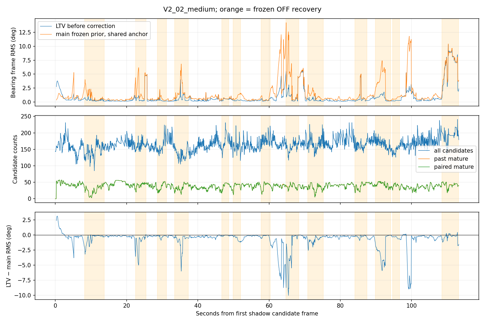
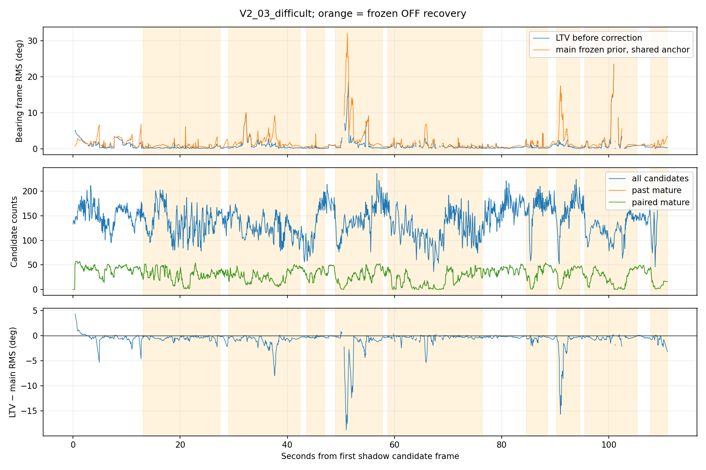

# Landmark 因果预测验证结果

冻结起点 `c2ddcf94e2ba4102531bd81903fb040d33546e35`；决策：**STOP_FUSION_CORRELATION_MODEL_UNAVAILABLE**。共同anchor主对照的阶段决策为 `CONTINUE_CORRELATION_AUDIT`，已完成后续审计。

本轮首先实现并运行当前观测消费前的只读shadow，没有实施landmark ON。两预测使用同一过去LTV三维点，主滤波用当前先验/存活anchor clone传播，LTV使用当前correction前状态；比较同一相机bearing。GT不参与预测或在线选择。关联按既有tracker/epoch/core-ID/entered-time合同核对，未用独立地图证明真实物理点同一；当前匹配污染及不一致的风险保留在失效与误差尾部中。

主指标使用过去已成熟的点、完整共同支持及每帧等权的角度RMSE。原始候选、单边/双边失效和无anchor保留分母；当前Active Consistency随后拒绝/退役的帧不会倒推删除。影子入口位于当前feature pipeline、LTV correction和主视觉更新之前。

## 预测误差与覆盖

| 序列 | 分区 | 成熟候选 / 共同有效 | LTV / main覆盖 | 每帧RMSE LTV / main rad | 改善比例 / 95%区间 | LTV / main P95 rad | LTV / main P99 rad | 可靠优势 |
|---|---|---:|---:|---:|---|---:|---:|---|
| V2_02_medium | primary_mature | 87075 / 87019 | 0.999793 / 0.999495 | 0.0313903 / 0.0479229 | 0.344983 / ['0.211542', '0.517522'] | 0.020642 / 0.0332885 | 0.0771721 / 0.177231 | True |
| V2_02_medium | normal | 49335 / 49309 | 0.999939 / 0.999534 | 0.0195901 / 0.0412897 | 0.525546 / ['0.327335', '0.660485'] | 0.010565 / 0.0269147 | 0.0467349 / 0.0743102 | True |
| V2_02_medium | recovery | 32963 / 32933 | 0.999545 / 0.999363 | 0.0431023 / 0.0577762 | 0.253978 / ['0.120386', '0.487996'] | 0.0178069 / 0.0468391 | 0.209408 / 0.3162 | True |
| V2_02_medium | startup | 4777 / 4777 | 1 / 1 | 0.029097 / 0.0240126 | -0.211741 / — | 0.0629492 / 0.0299361 | 0.084807 / 0.0546726 | False |
| V2_02_medium | past_ready | 61813 / 61787 | 0.999951 / 0.999628 | 0.0231435 / 0.0423544 | 0.453575 / ['0.275293', '0.59638'] | 0.0106845 / 0.0272199 | 0.0505702 / 0.0799001 | True |
| V2_02_medium | past_not_ready | 25262 / 25232 | 0.999406 / 0.999169 | 0.0448179 / 0.0586553 | 0.23591 / ['0.0898679', '0.525161'] | 0.0484328 / 0.0522859 | 0.231966 / 0.312972 | True |
| V2_02_medium | anchor_short | 2114 / 2114 | 1 / 1 | 0.0322104 / 0.0333651 | 0.0346082 / ['-0.0305586', '0.157888'] | 0.0343125 / 0.0194338 | 0.115654 / 0.124227 | False |
| V2_02_medium | anchor_long | 84961 / 84905 | 0.999788 / 0.999482 | 0.0313034 / 0.0482232 | 0.350865 / ['0.216213', '0.520466'] | 0.0203186 / 0.0335221 | 0.076606 / 0.177943 | True |
| V2_03_difficult | primary_mature | 55908 / 55899 | 0.999839 / 0.999839 | 0.030893 / 0.0512882 | 0.397659 / ['0.213682', '0.547018'] | 0.029863 / 0.0419698 | 0.0918675 / 0.122226 | True |
| V2_03_difficult | normal | 18021 / 18021 | 1 / 1 | 0.0179439 / 0.0260809 | 0.311991 / ['0.184183', '0.487481'] | 0.0139608 / 0.0378311 | 0.0805841 / 0.12457 | True |
| V2_03_difficult | recovery | 32534 / 32525 | 0.999723 / 0.999723 | 0.0340258 / 0.0592038 | 0.425277 / ['0.251267', '0.583495'] | 0.0149658 / 0.0400827 | 0.0595633 / 0.114826 | True |
| V2_03_difficult | startup | 5353 / 5353 | 1 / 1 | 0.0359658 / 0.0370482 | 0.029217 / — | 0.0862605 / 0.0589226 | 0.149648 / 0.144997 | False |
| V2_03_difficult | past_ready | 25559 / 25559 | 1 / 1 | 0.0171485 / 0.0248297 | 0.309356 / ['0.20222', '0.438729'] | 0.0122003 / 0.0334235 | 0.0719491 / 0.113911 | True |
| V2_03_difficult | past_not_ready | 30349 / 30340 | 0.999703 / 0.999703 | 0.0364 / 0.0613252 | 0.406443 / ['0.204316', '0.567746'] | 0.0421667 / 0.0460952 | 0.103596 / 0.131969 | True |
| V2_03_difficult | anchor_short | 1384 / 1384 | 1 / 1 | 0.0227582 / 0.0223373 | -0.0188459 / ['-0.298819', '0.163415'] | 0.0271118 / 0.0217162 | 0.113567 / 0.0914654 | False |
| V2_03_difficult | anchor_long | 54524 / 54515 | 0.999835 / 0.999835 | 0.0308927 / 0.0520948 | 0.406992 / ['0.220103', '0.56165'] | 0.0299132 / 0.0424108 | 0.091793 / 0.122611 | True |

改善比例为1−LTV/main；负数表示LTV更差。95%区间按1s时间块配对重采样，不能将相关点/相机当作独立样本。至少30个共同帧、10个时间块才给区间。5%投入判据、P95/P99最多恶化5%与不降低覆盖均在采集前冻结，不作为在线门控。

| 序列 | 全部原始候选 | 过去成熟候选 | 主有效 / LTV有效 / 共同 | 成熟候选失效原因 |
|---|---:|---:|---:|---|
| V2_02_medium | 374515 | 87075 | 87031 / 87057 / 87019 | {'ok': 87019, 'invalid_prediction': 56} |
| V2_03_difficult | 255895 | 55908 | 55899 / 55899 / 55899 | {'ok': 55899, 'invalid_prediction': 9} |

## 历史视觉补充对照与相关性审计

共同anchor主对照确实显示预测优势；但LTV期间消费了过去bearing，主对照只传播冻结点均值。补充对照用同点、同anchor窗口、同主先验、仅过去camera0 bearing，调用原LtvSeedEstimator拟合世界点，再预测当前bearing。它使用不同的过去点均值，不能替换主对照或声称是独立地图。当前和未来观测均被排除，全部主对照输出字段再次精确复现。

| 序列 | 分区 | 成熟候选 / LTV-过去几何共同有效 | LTV / 过去几何每帧RMSE rad | 改善比例 / 95%区间 | LTV / 过去几何P95 rad | 可靠优势 |
|---|---|---:|---:|---|---:|---|
| V2_02_medium | primary_mature | 87075 / 86140 | 0.0316789 / 0.059538 | 0.467922 / [-0.08867635068113464, 0.5929523154285891] | 0.0204234 / 0.0140828 | False |
| V2_02_medium | normal | 49335 / 49281 | 0.020701 / 0.0235133 | 0.119604 / [-0.21961525378306748, 0.3972298432871533] | 0.0106189 / 0.011768 | False |
| V2_02_medium | recovery | 32963 / 32084 | 0.0428995 / 0.0906101 | 0.526548 / [-0.04267482869630951, 0.6429034079824881] | 0.0171498 / 0.0207777 | False |
| V2_02_medium | startup | 4777 / 4775 | 0.0290872 / 0.00592352 | -3.91045 / None | 0.0628812 / 0.00990395 | False |
| V2_03_difficult | primary_mature | 55908 / 55584 | 0.0315506 / 0.0361006 | 0.126036 / [-0.17145461311735688, 0.3808103346436281] | 0.029751 / 0.0193461 | False |
| V2_03_difficult | normal | 18021 / 18014 | 0.0179464 / 0.0175452 | -0.0228702 / [-0.09766147406847506, 0.02609892643036591] | 0.0139659 / 0.0144813 | False |
| V2_03_difficult | recovery | 32534 / 32221 | 0.0349157 / 0.0421604 | 0.171836 / [-0.14199375702083772, 0.5061055573820652] | 0.0146804 / 0.0197044 | False |
| V2_03_difficult | startup | 5353 / 5349 | 0.0359703 / 0.020232 | -0.777892 / None | 0.0862852 / 0.0368249 | False |

补充对照中优势没有稳健通过1s时间块置信区间；不能证明LTV没有信息，也不能把共同anchor预测改善直接当作额外独立信息。不同的失效支持和过去几何的有效/无效计数均在correlation_audit.json保留（reasons字段仍是原主对照原因；补充拟合未保存内部拒绝理由，不推测其具体退化原因），没有通过替换支持隐藏问题。

| 序列 | 实际seed均值写入 | Observer出生P迹（固定gain metric） | 计算的seed协方差迹中位 / P95 / 最大 m² | 两者相等次数 |
|---|---:|---:|---:|---:|
| V2_02_medium | 2574 | 3 | 0.00384359 / 0.0389711 / 0.107959 | 0 |
| V2_03_difficult | 2784 | 3 | 0.0071546 / 0.037544 / 0.0983418 | 0 |

出生接口只传入均值，不传入seed协方差或与主状态的交叉块；P按固定初值及Riccati形式演化。seed协方差本身也是局部线性风险估计，不是已校准真误差。以上差异说明不能直接把Observer P认作物理误差协方差，不能证明它一定是不保守的上界。

审计保存了离散误差协方差与Riccati metric不自动等价的数值反例。可解释的联合方案还需要seed增广、共享IMU/main bias供给、相机全部Euler子步与bearing相关Jacobian、主视觉更新/reset、anchor协方差及历史观测噪声映射；当前接口和缓存未提供这些交叉块或完整消费来源。实现这套误差传播将超出最小融合改动，本轮不扩大架构，也不运行未知交叉块置零的探索ON。

**收尾选择：保留因果shadow工具和共同anchor预测价值证据，停止本轮两时刻landmark ON路径。** 没有融合收益结论，原因是增强预测对照未给出稳健的增量优势，且可解释的相关性模型需要超出本轮边界的误差传播架构。

## 轨迹、实际更新与数值边界

以下为冻结OFF原始指标。没有ON轨迹，不能将shadow误差或OFF指标写成融合收益。

| 序列 | ATE m | 1s平移RPE m / 旋转RPE ° | 5s平移RPE m / 旋转RPE ° | 覆盖 / 样本 |
|---|---:|---:|---:|---:|
| V2_02_medium | 0.0519752 | 0.0242838 / 0.300205 | 0.0493023 / 0.915869 | 1.0 / 2252 |
| V2_03_difficult | 0.207428 | 0.0447823 / 0.453368 | 0.0988261 / 0.968568 | 1.0 / 1799 |

landmark实际更新0；无landmark门控或提交拒绝，因为未构建融合行。状态各块修正0；没有ON协方差或首次融合分歧可报告。这是未进入融合阶段，不是融合被全部拒绝。

## 相关性与路径选择

当前seed世界点依赖主位姿；同一tracker观测可进入seed、LTV和主MSCKF。缓存没有逐观测主消费账本，无法量化每条约束实际重复使用的比例。两时刻残差消去世界点均值，但不消除跨时间、跨点、LTV-main和LTV-visual相关性。现有Observer P按连续Riccati形式演化，不能直接宣称是校准的landmark误差协方差。

本轮没有传播这些交叉块，也没有将未知块置零、调大噪声或增加门控替代建模。停止/继续判断首先依据因果预测证据；预测优势本身不证明独立信息或统计一致性。

若决策为停止，则保留shadow诊断与缓存分析工具，停止当前max_slam=0、冻结seed/history条件下的两时刻landmark融合研究；不据此断言其他地图、观测或序列均无潜在收益。不增加权重扫描、SLAM状态或视觉退化实验。生产融合保持关闭，R4未闭合项保持原状态。

## 验证、身份与资源

详见delivery.json、各序列exact.json、off_parity.json和tests.json。缓存重放逐事件精确核对原Observer x/P、输入、ID/slot、生命周期、Consistency和readiness；缓存shadow没有运行主EKF，主先验来自未修改的原缓存。另以新库真实OFF回放精确核对主状态/完整P的身份摘要及Observer完整矩阵。OFF的联合矩阵日志未导出数值数组，其空内容哈希相同不代表额外完整P证据；完整主P参与state_digest。不能混称为在线shadow ON回放。

大缓存、预测逐行向量、完整曲线、构建和日志在 `/home/he/output/ltv_landmark_validation_20261005`，未提交。每次失败和重跑进入独立账本；既有R4账本及预留未修改。没有独立未选参数据，不给收益泛化结论。

| 采集任务 | 退出码 | 用时 s | 峰值RSS MiB |
|---|---:|---:|---:|
| V2_02_medium_shadow | 0 | 35.8841 | 108.305 |
| V2_03_difficult_shadow | 0 | 22.4509 | 108.59 |
| V2_02_medium_OFF | 0 | 60.7599 | 130.91 |
| V2_03_difficult_OFF | 0 | 41.0329 | 129.035 |
| V2_02_medium_past_geometry | 0 | 36.0833 | 107.125 |
| V2_03_difficult_past_geometry | 0 | 22.1866 | 108.512 |

资源是各工具端到端测量，未测在线shadow或融合开销，不能用并发/不同工具的耗时差直接推算新增开销。离线Python分析峰值约2.5 GiB；原生shadow约110 MiB。两次真实OFF、四次缓存重放均成功；两次离线分析故障（时间表示关联、启动日志可选seed字段）已保留，并执行对应回归，无真实回放失败或参数扫描。

ROS/colcon构建、24项既有原生测试、新shadow几何/因果时序/精确性测试、C++14兼容及7项离线回归通过。main没有在线shadow ON；缓存输入与原始主先验保持不变。

脚本入口：run.py 的 build/check_install/collect/off_parity/collect_past；analyze.py 用于原始共同anchor对照，audit.py 用于过去几何与相关性审计，render.py输出本报告。命令及退出码完整保存于delivery.json和外部attempts.jsonl。

