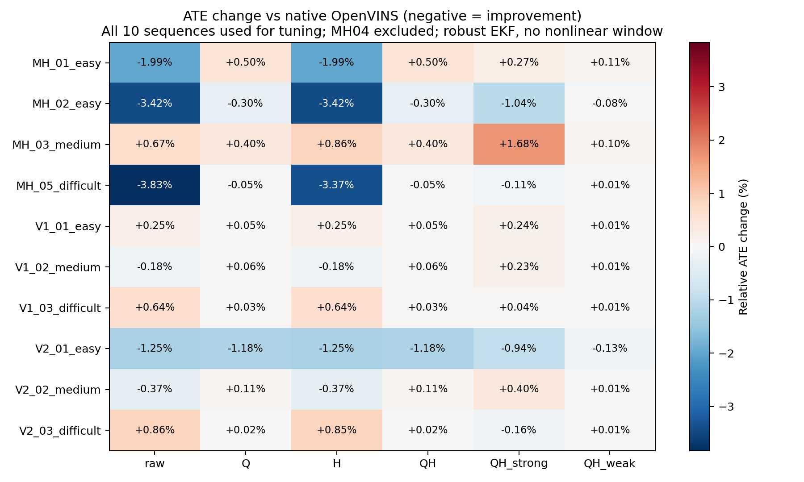

# 质量门控 / Huber 全 EuRoC 调参对照

**这是全10条样本内调参结果，MH04按用户原指示跳过；没有加入滑窗非线性后端，也不构成跨数据集泛化验证。**

按预先固定的ATE选参目标，本轮没有发现质量门控、Huber或两档组合权重优于原GV。原GV的平均逐序列相对ATE改善约0.86%，6条改善、4条退化；这说明存在小幅样本内收益，不能判定LTV与OpenVINS不兼容，也不能称已证明稳定泛化。

候选与选参目标在运行前冻结；70次候选完整运行、10次选中配置重复。重复的轨迹和完整审计要求逐字节相同。原始NIS始终开启，observer参数不变。现有OpenVINS门控的innovation归一化为sqrt(3N)，VINS为sqrt(N)，因此同名0.03阈值并不等价；本轮也未复刻G最低15特征和独立cooldown，不能称T2逐项parity。质量门控和Huber见[计划](plan.md)，滑窗方案边界见[设计](window_design.md)。

|候选|平均ATE m|平均相对B变化 %（负为改善）|中位变化 %|最坏变化 %|1s RPE m|
|---|---:|---:|---:|---:|---:|
|B|0.131648|+0.000|+0.000|+0.000|0.040761|
|raw|0.129962|-0.861|-0.277|+0.863|0.040625|
|Q|0.131569|-0.037|+0.042|+0.498|0.040743|
|H|0.130117|-0.796|-0.276|+0.857|0.040624|
|QH|0.131569|-0.037|+0.042|+0.498|0.040743|
|QH_strong|0.131676|+0.062|+0.137|+1.684|0.040272|
|QH_weak|0.131661|+0.007|+0.010|+0.110|0.040733|

按预先固定目标选中的辅助配置为 **raw**。这里是辅助候选中的最优；若仍高于B，不能称优于原生。平均绝对ATE和平均逐序列相对变化属于不同统计量。

|序列|B ATE|raw ATE|Q ATE|H ATE|QH ATE|QH strong ATE|QH weak ATE|
|---|---:|---:|---:|---:|---:|---:|---:|
|MH_01_easy|0.185446|0.181761|0.186369|0.181761|0.186369|0.185954|0.185650|
|MH_02_easy|0.097199|0.093879|0.096903|0.093879|0.096903|0.096187|0.097120|
|MH_03_medium|0.149282|0.150278|0.149878|0.150561|0.149878|0.151796|0.149436|
|MH_05_difficult|0.276242|0.265654|0.276105|0.266940|0.276105|0.275942|0.276274|
|V1_01_easy|0.064253|0.064417|0.064287|0.064417|0.064287|0.064405|0.064262|
|V1_02_medium|0.068188|0.068063|0.068227|0.068063|0.068227|0.068346|0.068198|
|V1_03_difficult|0.041891|0.042161|0.041904|0.042161|0.041904|0.041909|0.041894|
|V2_01_easy|0.174581|0.172405|0.172513|0.172405|0.172513|0.172934|0.174357|
|V2_02_medium|0.051975|0.051782|0.052033|0.051783|0.052033|0.052186|0.051980|
|V2_03_difficult|0.207428|0.209217|0.207472|0.209197|0.207472|0.207101|0.207438|

QH_strong的平均1秒RPE低于raw（0.040272 vs 0.040625 m），但平均相对ATE变为退化0.062%，最坏单序列退化1.684%。这是指标间的取舍；本轮没有看到RPE后改换选参目标。

|候选|G接受数|V接受数|G被Huber降权数|V被Huber降权数|
|---|---:|---:|---:|---:|
|raw|20812|21053|0|0|
|Q|16043|7854|0|0|
|H|20812|21053|0|588|
|QH|16043|7854|0|0|
|QH_strong|16043|7860|10|0|
|QH_weak|16043|7853|0|0|

Huber只处理通过原始NIS和quality gate的辅助块，因此可能没有实际降权。特别是V门控要求残差≤0.5m/s，而组合候选sigma≥0.5m/s，白化范数≤1<delta=2，所以这些组合的V分支在本次单步更新中理论上不会触发Huber。若权重恒为1，该候选就是对照验证，不能声称Huber带来提升。sigma同时影响更新增益和原始NIS，因此strong/weak并不是仅改变已接受观测的增益。接受率、更新量、逐序列RPE/ATE和全部失败记录需共同解读，不能只报告最佳均值。

## 验证与产物

独立ROS2构建和10个原生测试通过；其中新测试直接覆盖实际UpdaterLTV的降权、原始NIS/quality拒绝、完整Joseph协方差与一次提交。源observer、原预测、golden未修改。10次选中配置重复的轨迹/审计逐字节相同。扩展G大角度和native delta测试通过；第一次调用误用build路径退出127，程序未执行，修正路径后的退出码为0，两个日志均保留。

紧凑证据见[evidence](evidence/)，全部配置、输入哈希、有效选项、命令、退出码和日志保存在 `/home/he/output/openvins_ltv_robust_fusion_20261003`。构建复用旧冻结ov_core/ov_init依赖，ov_msckf单独编译；完整矩阵各自单线程，最多4任务并发；两次短段回归及扩展测试曾与矩阵重叠运行。耗时是该并发设置的墙钟时间，不与旧单任务测量直接作性能比。

复现入口：`python3 -B scripts/ltv_robust/study.py`（严格身份核对包括HEAD，应使用冻结实现提交0a7a5aa；新文档提交不会改写旧实验身份）；`python3 -B scripts/ltv_robust/report.py`。
