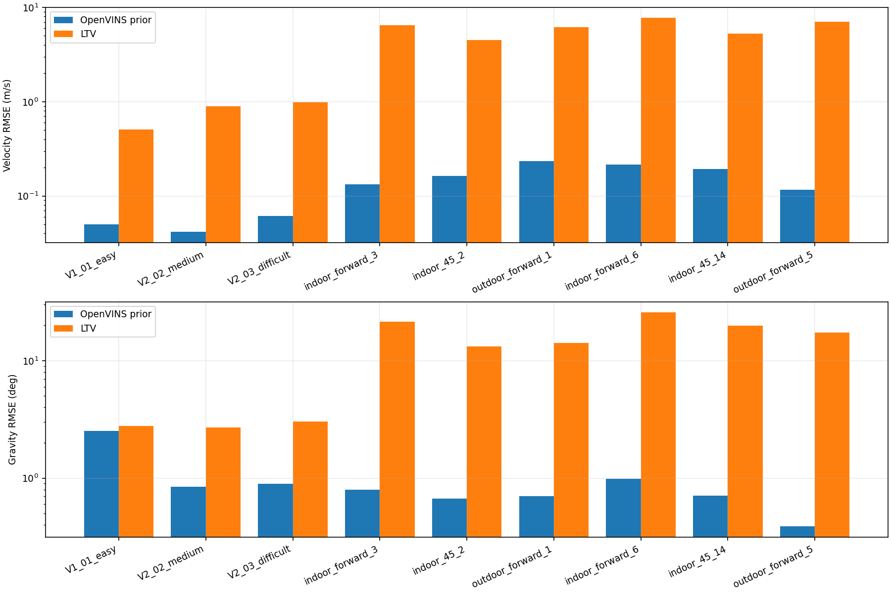

# LTV 信息价值与 UZH-FPV 代表集验证报告

本轮以[value_study_goal.md](value_study_goal.md)为合同；旧EuRoC全量报告不改写，MH_04按用户要求跳过。
完整运行矩阵与科学有效性分开判断。数据选择、5%机制门槛、GT求导窗口和最大80次回放均在本轮效果分析前确定。

## 结论与下一步判断

当前实现有少量可复现的闭环ATE收益，但证据不支持“换更激烈的数据集后，LTV就成为更准确、更有增量价值的G/V观测”。本轮未达到预先约定的机制门槛，因此保持原权重，不继续调参或扩展序列。

UZH独立验证三条的ATE均值相对B：G +1.211%，V -0.053%，GV +0.871%。G三条均有正向变化，但主要收益来自outdoor_forward_5；GV有两条改善、一条近零退化；V有改善也有退化。这些是固定配置下的实际结果，不是跨场景显著性结论。

验证集原生输出中的GT可评价比例分别为indoor_forward_6 45.8%, indoor_45_14 61.2%, outdoor_forward_5 19.6%。尤其主要ATE收益所在outdoor_forward_5的GT支持较短。所有模式都完整回放且在固定GT支持上输出覆盖100%，但不能将这些ATE结果推广为整段无GT输入的定位可靠性。

|分支|本轮判断|依据|
|---|---|---|
|G|局部闭环收益，机制证据不足|六条UZH中LTV G方向RMSE均明显大于prior；同prior单步收益极小，开发资格为否。不能据少量ATE改善增强G。|
|V|当前配置不支持稳定增益|六条UZH中LTV速度RMSE均明显大于prior；参考求导窗口不改变这一量级结论；验证平均ATE略退化。|
|GV|局部ATE收益，尚不能证明互补机制|验证平均有小幅改善，但未达到预定直接精度/单步机制门槛；组合并未稳定优于G-only。|

UZH在本代表集中的参考速度和比力变化确实更大；并非每条UZH的角速度都高于每条EuRoC。六条UZH的GT支持区间比力变化P95约3.99–9.32m/s²，EuRoC为1.77–1.95m/s²。更激烈的运动没有自动转化为当前LTV输出质量优势，因此不能把“EuRoC太简单”作为未见明显提升的主要解释。

更直接的瓶颈是第一层输出质量：在共同有效支持上，UZH参考速度范数RMS为4.08–6.91m/s，LTV为0.61–2.21m/s，同时存在明显方向/重力误差。这是观测到的幅度不足，不等于已证明某个增益、坐标或时延是根因。源码中路标和基础状态从零初始化、特征更替及连续健康帧条件值得单独检验，但本轮没有通过修改它们来寻找更好ATE。

经验误差相关性随序列和轴变化，不能认定全为独立，也不能把相关性宣布为本轮失败的唯一原因。先证明第一层在受控几何/已知输入下能收敛并保持速度幅度，再检查特征寿命与动态可观性，之后才值得讨论相关融合或更强权重。这是后续建议，本Goal到此停止；不自动改核心、不扩展全量UZH。

工程验收和科学结论分开：输入、数学/FEJ、旁路一致性、联合提交及复测通过，并不证明有新的独立信息，也不保证Riccati可作为量测噪声。

## 实现、冻结与完整性

冻结辅助参数：C0，G=10°、V=1m/s；额外权重候选0组。G/V均未达到2/3 UZH开发序列的预定机制门槛，因此没有增强权重，也没有改observer参数。

新增默认OFF的只读诊断，在真实压缩视觉块上保存prior/FEJ/P、LTV snapshot及H/res/R、单步shadow、实际posterior。正式主状态仍只调用一次原生EKF。新runner读取sensor-only派生目录，GT仅由Python离线程序读取。
完整源文件/配置/二进制/库身份见输出根experiment_manifest.json与逐run manifest。原生预测、State、StateHelper、IMU、JPLQuat、UpdaterHelper和observer核心未改。
B/P记录包含完整状态/P/FEJ/clone/视觉集合digest；新EuRoC B与旧正式B三条全部字节一致。诊断OFF/ON及B/P短段均字节一致。
所有formal模式使用同一原生设置；UZH使用对应固定标定、MSCKF-only配置，不能代替OpenVINS完整原默认配置的性能结论。

### 输入完整性与初始化

完整回放指消费全部IMU和全部**精确同步的双目对**，并不把未配对图像算作已送入双目估计器。以下为B；每种模式使用相同输入。V2_03左右图像数量不等，未配对数量如实保留，未按效果选择裁剪区间。

|序列|同步双目对|未配对左/右图|IMU样本|B输出数|首次输出距首图秒数|
|---|---:|---|---:|---:|---:|
|V1_01_easy|2912|0/0|29120|2800|5.600|
|V2_02_medium|2348|0/0|23490|2266|4.100|
|V2_03_difficult|1921|1/415|23370|1806|5.800|
|indoor_forward_3|2552|0/0|46053|2275|9.454|
|indoor_45_2|1965|0/0|37339|1783|6.336|
|outdoor_forward_1|2390|0/0|42878|2211|6.004|
|indoor_forward_6|1970|0/0|34815|1781|6.369|
|indoor_45_14|1836|0/0|32269|1674|5.474|
|outdoor_forward_5|2457|0/0|45585|2262|6.767|

## 直接误差：Passive LTV 与 OpenVINS prior

同一物理IMU时刻、同机体系，不施加ATE对齐旋转。G为方向夹角RMSE(deg)，V为向量RMSE(m/s)。每分支仅在双方参考量和LTV该分支有效的相同支持上计算；有效比例另列。V1_01姿态参考有官方已知限制。

|序列|Prior G|LTV G|LTV G胜出|Prior V|LTV V|LTV V胜出|G/V有效事件比例|
|---|---:|---:|---:|---:|---:|---:|---:|
|V1_01_easy|2.517904|2.775307|41.65%|0.049737|0.509184|0.72%|97.8%/98.6%|
|V2_02_medium|0.842659|2.695626|9.73%|0.041560|0.894577|0.32%|95.7%/96.8%|
|V2_03_difficult|0.892253|3.022172|8.64%|0.061592|0.981682|0.14%|76.2%/77.6%|
|indoor_forward_3|0.796550|21.364860|1.63%|0.133660|6.452315|2.48%|56.7%/56.7%|
|indoor_45_2|0.666893|13.197263|8.18%|0.162428|4.488872|5.93%|44.6%/44.5%|
|outdoor_forward_1|0.704197|14.146016|0.99%|0.234536|6.136487|2.34%|50.4%/50.2%|
|indoor_forward_6|0.989491|25.733957|8.08%|0.214185|7.716586|4.83%|31.9%/36.0%|
|indoor_45_14|0.712351|19.893021|6.38%|0.192661|5.293310|14.58%|20.6%/20.5%|
|outdoor_forward_5|0.389359|17.321893|0.37%|0.116498|7.012840|1.47%|12.0%/12.0%|

有效事件比例的分母是该序列**全部更新诊断事件**，包含尚无GT支持、warmup及无效snapshot；未把这些事件从分母删除。以下另列参考支持，避免把GT缺失等同LTV不可用。

|序列|全部事件|GT姿态|GT速度|GT+LTV G|GT+LTV V|
|---|---:|---:|---:|---:|---:|
|V1_01_easy|2800|2780|2780|2737|2761|
|V2_02_medium|2266|2252|2252|2169|2193|
|V2_03_difficult|1806|1799|1799|1377|1401|
|indoor_forward_3|2275|1332|1330|1291|1289|
|indoor_45_2|1783|1264|1262|795|793|
|outdoor_forward_1|2211|1164|1161|1114|1111|
|indoor_forward_6|1781|816|813|569|642|
|indoor_45_14|1674|1025|1023|345|343|
|outdoor_forward_5|2262|444|443|272|272|

## UZH是否更困难，以及困难区间是否受益

下面比较完整原始IMU输入与GT支持区间的一秒窗口RMS之P95。角速度单位rad/s；比力变化为abs(norm(a)−g)，单位m/s²，**不是真实平移加速度**。末尾无GT支持的冲击保留在全输入列，不用于解释飞行区间优势。

|序列|全输入角速P95|GT支持角速P95|全输入比力P95|GT支持比力P95|
|---|---:|---:|---:|---:|
|V1_01_easy|0.594913|0.595469|1.766645|1.768511|
|V2_02_medium|1.146980|1.150057|1.944550|1.948516|
|V2_03_difficult|1.194702|1.195448|1.894123|1.896171|
|indoor_forward_3|2.168951|2.192172|5.618097|5.648322|
|indoor_45_2|1.477151|1.537952|4.350583|3.990405|
|outdoor_forward_1|0.973663|0.992513|5.410442|5.447466|
|indoor_forward_6|2.762043|2.824614|9.132263|9.324029|
|indoor_45_14|1.957918|2.057757|6.873881|6.630242|
|outdoor_forward_5|1.251079|1.486296|8.025919|8.267954|

困难分层阈值由EuRoC三条和UZH开发三条分别冻结；验证复用UZH阈值。下表按原先规定的整体/高旋转/高比力/弱视觉/无视觉报告，交集的全部结果见mechanism JSON；时长不足5s仅描述。G/V单步改善以百分比表示，正值为受益。

|序列|分层|G/V有效秒数|LTV/Prior G RMSE比|LTV/Prior V RMSE比|G单步改善|V单步改善|
|---|---|---:|---:|---:|---:|---:|
|V1_01_easy|high_rotation|0.0/0.0|N/A|N/A|N/A|N/A|
|V1_01_easy|high_force|18.8/18.8|1.058992|9.815321|+0.000%|-0.003%|
|V1_01_easy|weak_visual|27.2/27.3|1.137814|10.075532|+0.000%|-0.001%|
|V1_01_easy|zero_visual|14.3/14.6|1.142506|10.809358|-0.000%|-0.000%|
|V2_02_medium|high_rotation|41.6/41.6|3.229656|18.944289|+0.000%|-0.002%|
|V2_02_medium|high_force|32.5/33.4|2.931626|18.650913|-0.000%|+0.006%|
|V2_02_medium|weak_visual|20.0/20.2|3.117084|19.763839|+0.000%|-0.001%|
|V2_02_medium|zero_visual|3.7/3.7|1.401945|8.824387|+0.000%|-0.001%|
|V2_03_difficult|high_rotation|33.9/34.1|2.937014|14.884721|-0.000%|-0.001%|
|V2_03_difficult|high_force|22.8/23.4|3.178945|15.870154|+0.000%|+0.003%|
|V2_03_difficult|weak_visual|20.0/20.6|3.223615|13.347816|-0.000%|+0.003%|
|V2_03_difficult|zero_visual|3.2/3.3|3.373824|6.942662|-0.000%|+0.001%|
|indoor_forward_3|high_rotation|21.3/21.3|21.339887|47.316904|-0.001%|-0.001%|
|indoor_forward_3|high_force|16.2/16.2|22.690717|46.254673|-0.002%|-0.002%|
|indoor_forward_3|weak_visual|8.1/8.1|27.094901|53.485137|-0.003%|+0.001%|
|indoor_forward_3|zero_visual|1.1/1.1|38.036604|51.199246|-0.009%|+0.000%|
|indoor_45_2|high_rotation|6.3/6.3|18.657695|30.327763|-0.001%|+0.004%|
|indoor_45_2|high_force|0.4/0.4|2.141794|2.354423|-0.002%|+0.000%|
|indoor_45_2|weak_visual|5.0/5.0|21.843082|26.727167|-0.002%|-0.002%|
|indoor_45_2|zero_visual|1.6/1.6|11.613221|23.397726|+0.000%|-0.005%|
|outdoor_forward_1|high_rotation|1.2/1.2|32.493665|64.155232|-0.026%|+0.000%|
|outdoor_forward_1|high_force|11.7/11.7|17.710263|27.424581|-0.014%|-0.022%|
|outdoor_forward_1|weak_visual|10.3/10.3|18.785690|28.183177|-0.011%|-0.012%|
|outdoor_forward_1|zero_visual|1.0/1.0|15.944302|31.418947|-0.011%|+0.000%|
|indoor_forward_6|high_rotation|10.9/13.1|22.258052|35.161776|+0.001%|+0.000%|
|indoor_forward_6|high_force|13.8/16.3|26.166600|35.932413|+0.000%|+0.000%|
|indoor_forward_6|weak_visual|4.3/4.8|24.426873|38.113487|+0.001%|+0.000%|
|indoor_forward_6|zero_visual|0.5/0.5|13.803069|48.508849|+0.001%|-0.000%|
|indoor_45_14|high_rotation|5.9/5.9|23.636423|25.818948|+0.001%|+0.000%|
|indoor_45_14|high_force|3.5/3.5|29.600051|31.373763|-0.000%|+0.000%|
|indoor_45_14|weak_visual|2.8/2.8|31.494189|29.871178|+0.000%|+0.000%|
|indoor_45_14|zero_visual|1.6/1.6|21.139317|10.319391|-0.000%|+0.012%|
|outdoor_forward_5|high_rotation|0.3/0.3|37.291540|193.377468|-0.010%|+0.000%|
|outdoor_forward_5|high_force|7.7/7.7|45.172678|59.747198|-0.016%|+0.008%|
|outdoor_forward_5|weak_visual|2.8/2.8|35.532237|61.539552|-0.009%|+0.002%|
|outdoor_forward_5|zero_visual|0.2/0.2|20.172721|42.385101|-0.003%|+0.005%|

## 同prior更新归因与误差互补性

表中正值表示visual+辅助的单步误差比visual-only更小。此处保持历史、prior/P和已接受视觉块不变，只是单步反事实；不是闭环干预证明。K分块范数不被当作增量收益。

|序列|G单步RMSE改善|G 95%块区间|V单步RMSE改善|V 95%块区间|
|---|---:|---|---:|---|
|V1_01_easy|+0.000%|[-0.000%, +0.000%]|-0.001%|[-0.001%, -0.000%]|
|V2_02_medium|+0.000%|[-0.000%, +0.001%]|-0.000%|[-0.009%, +0.009%]|
|V2_03_difficult|-0.000%|[-0.001%, +0.001%]|+0.001%|[-0.005%, +0.007%]|
|indoor_forward_3|-0.002%|[-0.003%, +0.001%]|+0.001%|[-0.004%, +0.006%]|
|indoor_45_2|-0.003%|[-0.005%, -0.002%]|-0.008%|[-0.023%, -0.000%]|
|outdoor_forward_1|-0.011%|[-0.017%, -0.006%]|-0.005%|[-0.018%, +0.000%]|
|indoor_forward_6|+0.000%|[-0.004%, +0.006%]|+0.000%|[-0.000%, +0.001%]|
|indoor_45_14|+0.000%|[-0.001%, +0.001%]|+0.001%|[+0.000%, +0.002%]|
|outdoor_forward_5|-0.016%|[-0.041%, +0.011%]|+0.015%|[+0.000%, +0.050%]|

块bootstrap使用1s、2000次、seed42，区间仅描述该序列内部的连续数据，不构成跨场景统计显著性。三轴/切平面相关、交叉二阶矩、prior误差与修正方向内积以及连续受益/受损区间保存在逐序列mechanism JSON。
近零方差相关系数标为null；共享输入相关性仍未建模，不把经验相关或NIS通过解释成全系统一致性。

|序列|G相关对角线|V相关对角线|G误差·候选方向均值|V误差·候选方向均值|
|---|---|---|---:|---:|
|V1_01_easy|0.566735, 0.213533|0.223336, 0.085315, 0.156931|-0.000027|0.001690|
|V2_02_medium|0.303280, 0.135419|0.016137, 0.024220, 0.104917|-0.000002|0.000300|
|V2_03_difficult|0.321158, 0.216171|-0.166207, 0.066064, 0.064481|0.000021|0.000053|
|indoor_forward_3|0.280568, -0.030287|-0.280510, 0.066639, 0.111586|0.001245|-0.122405|
|indoor_45_2|0.566666, 0.099070|0.615362, 0.617369, 0.401660|0.000921|0.487944|
|outdoor_forward_1|0.467907, 0.559647|0.164176, 0.476678, 0.414337|0.000860|0.601670|
|indoor_forward_6|0.301949, 0.073672|0.286614, 0.053221, 0.370166|0.001837|0.450723|
|indoor_45_14|0.522366, -0.345527|0.353851, 0.688084, 0.438814|0.000726|0.578050|
|outdoor_forward_5|0.586488, 0.475734|-0.497472, 0.469407, 0.331741|0.000804|-0.118880|

候选方向为LTV−prior；内积为负只表示小步朝此方向的一阶趋势，不保证有限步或实际Kalman更新获益。G在共同参考切平面以rad计算，二维基随参考方向确定；V单位为m/s，不能跨单位比较内积大小。

### 参考速度求导敏感性

各窗口均使用自己的有效支持，支持数随窗口变化保存在JSON；不外推。下表列出0.05/0.10/0.20s各自的LTV/prior速度RMSE比和单步V改善；大于1表示LTV较差。

|UZH序列|LTV/prior比（0.05/0.10/0.20s）|单步V改善（0.05/0.10/0.20s）|
|---|---|---|
|indoor_forward_3|48.274324 / 48.274255 / 48.286762|+0.001% / +0.001% / +0.001%|
|indoor_45_2|27.635932 / 27.636017 / 27.624238|-0.008% / -0.008% / -0.008%|
|outdoor_forward_1|26.164377 / 26.164368 / 26.195449|-0.005% / -0.005% / -0.005%|
|indoor_forward_6|36.027760 / 36.027594 / 36.023949|+0.000% / +0.000% / +0.000%|
|indoor_45_14|27.474465 / 27.474696 / 27.485954|+0.001% / +0.001% / +0.001%|
|outdoor_forward_5|60.197445 / 60.197305 / 60.204191|+0.015% / +0.015% / +0.016%|

## 闭环ATE与鲁棒性

单位m，Δ=100(B−method)/B。沿用最近GT≤20ms、无尺度SE3；传感器输出覆盖与GT可评价支持分开。基线首次输出后固定支持，门槛99%，未为某模式裁困难区间。RPE1s/5s、旋转/速度及count/NIS等见原始metrics和diagnostics.csv。

|序列|B|P|G|ΔG|V|ΔV|GV|ΔGV|
|---|---:|---:|---:|---:|---:|---:|---:|---:|
|V1_01_easy|0.064243|0.064243|0.064251|-0.012%|0.064398|-0.242%|0.064406|-0.255%|
|V2_02_medium|0.051975|0.051975|0.051997|-0.042%|0.051760|+0.415%|0.051782|+0.372%|
|V2_03_difficult|0.207428|0.207428|0.207162|+0.128%|0.209170|-0.840%|0.209217|-0.863%|
|indoor_forward_3|0.259518|0.259518|0.261496|-0.762%|0.259856|-0.130%|0.261521|-0.772%|
|indoor_45_2|0.670000|0.670000|0.670371|-0.055%|0.669850|+0.022%|0.670195|-0.029%|
|outdoor_forward_1|0.770277|0.770277|0.763894|+0.829%|0.766216|+0.527%|0.763096|+0.932%|
|indoor_forward_6|0.412663|0.412663|0.412363|+0.073%|0.406551|+1.481%|0.411987|+0.164%|
|indoor_45_14|0.397369|0.397369|0.397289|+0.020%|0.397450|-0.020%|0.397376|-0.002%|
|outdoor_forward_5|0.906800|0.906800|0.886397|+2.250%|0.913737|-0.765%|0.892509|+1.576%|

|分组|共同有效/总数|B均值|G均值|V均值|GV均值|ΔGV|
|---|---:|---:|---:|---:|---:|---:|
|EuRoC回归|3/3|0.107882|0.107803|0.108443|0.108468|-0.544%|
|UZH开发|3/3|0.566599|0.565254|0.565307|0.564937|+0.293%|
|UZH独立验证|3/3|0.572278|0.565350|0.572579|0.567291|+0.871%|
|全部代表集|9/9|0.415586|0.412802|0.415443|0.413565|+0.486%|

B/GV的RPE平移RMSE(m)如下；对应旋转、配对数及G/V单分支结果均在原始结果JSON。

|序列|B 1s RPE|GV 1s RPE|B 5s RPE|GV 5s RPE|
|---|---:|---:|---:|---:|
|V1_01_easy|0.044564|0.044567|0.167931|0.167960|
|V2_02_medium|0.024284|0.024284|0.049302|0.049277|
|V2_03_difficult|0.044782|0.044412|0.098826|0.098240|
|indoor_forward_3|0.161250|0.159437|0.415590|0.416523|
|indoor_45_2|0.188303|0.188445|0.533709|0.537271|
|outdoor_forward_1|0.339463|0.341329|1.037054|1.053596|
|indoor_forward_6|0.243824|0.243391|0.668224|0.666914|
|indoor_45_14|0.201148|0.200891|0.482137|0.482953|
|outdoor_forward_5|0.844465|0.830189|1.854774|1.862817|

巨大定位漂移预先定义为ATE>max(5m,GT包围盒对角线)，与数值有限/输入完成区分；该标签不覆盖所有可能的定位质量问题。若发生失败，原ATE和运行目录全部保留。

### 辅助是否实际参与

以下取正式GV；分母为进入MSCKF阶段的诊断事件。NIS拒绝和warmup分别保留，不能将接受次数或小NIS解释为量测更接近GT。每个事件EKF调用数均审计为0或1。

|序列|事件数|G接受|V接受|V NIS拒绝|warmup/core无效|G/V更新范数P95|shadow/native IMU均值最大相对差|
|---|---:|---:|---:|---:|---:|---|---:|
|V1_01_easy|2800|2757|2781|0|19|0.000011/0.000037|9.69e-16|
|V2_02_medium|2266|2183|2207|0|59|0.000021/0.000122|4.17e-16|
|V2_03_difficult|1806|1380|1404|0|402|0.000033/0.000243|2.00e-15|
|indoor_forward_3|2275|2094|1013|1182|80|0.000500/0.011731|6.09e-16|
|indoor_45_2|1783|1209|575|681|527|0.000141/0.001154|1.73e-15|
|outdoor_forward_1|2211|2086|1056|1063|92|0.002584/0.002525|1.37e-15|
|indoor_forward_6|1781|1162|883|661|237|0.000463/0.000509|4.63e-16|
|indoor_45_14|1674|819|651|269|754|0.000244/0.000354|2.26e-15|
|outdoor_forward_5|2262|1893|1352|635|275|0.002046/0.000465|3.07e-15|

更新范数是日志中的整体状态修正分量范数，混合不同状态单位，仅作同实现内部的作用量诊断，不能当作统一物理误差。RPE与各模式覆盖完整数值保留在final_results.json。

## 复测

|序列|模式|首次ATE|复测ATE|轨迹字节一致|完整审计字节一致|
|---|---|---:|---:|---|---|
|V1_01_easy|B|0.064243|0.064243|True|True|
|V1_01_easy|G|0.064251|0.064251|True|True|
|V1_01_easy|V|0.064398|0.064398|True|True|
|V1_01_easy|GV|0.064406|0.064406|True|True|
|outdoor_forward_5|B|0.906800|0.906800|True|True|
|outdoor_forward_5|G|0.886397|0.886397|True|True|
|outdoor_forward_5|V|0.913737|0.913737|True|True|
|outdoor_forward_5|GV|0.892509|0.892509|True|True|
|indoor_45_14|B|0.397369|0.397369|True|True|
|indoor_45_14|G|0.397289|0.397289|True|True|
|indoor_45_14|V|0.397450|0.397450|True|True|
|indoor_45_14|GV|0.397376|0.397376|True|True|

同机同输入的重复只检验确定性复现；不替代不同平台、噪声试验或跨场景统计。

## 分项成本

为保持正式回放的冻结库不变，另用可选LD_PRELOAD包裹现有辅助build、原生EKF和gzwrite符号，只计时并调用原函数。四次短段计入短段预算；每次均与原未插桩GV短段比较轨迹及完整状态审计。实际辅助构造与三个shadow辅助构造按每事件调用顺序区分，并严格检查次数。诊断OFF列最接近本机估计链路开销；不是独立实时性能基准。

|序列|诊断|实际辅助构造均值/P95 ms|原生EKF均值/P95 ms|gzip均值/P95 ms|轨迹/审计一致|
|---|---|---:|---:|---:|---|
|V1_01_easy|diagnostics_on|0.311932/0.333188|0.252442/0.350576|1.780038/2.023130|True|
|V1_01_easy|diagnostics_off|0.312917/0.333301|0.254471/0.352947|N/A/N/A|True|
|indoor_forward_3|diagnostics_on|0.293585/0.324048|0.206554/0.349619|1.689856/1.998287|True|
|indoor_forward_3|diagnostics_off|0.293048/0.324844|0.206768/0.348858|N/A/N/A|True|

Observer、MSCKF扣除诊断计算、诊断计算总时长见各mechanism JSON；短段每事件均值/P95见cost_profile.json。gzwrite只计压缩写入调用，不含析构flush；插桩日志自身开销在计时区间之外。

## 参考数据、时间与成本限制

- UZH本地6条GT SHA与官网当前v3包逐字节一致；核对仅下载ZIP目录和GT，不替换原文件。其生成涉及视觉、IMU、全局位置批优化，姿态与速度不是完全独立传感器真值。
- UZH参考速度由0.10s局部三次位置拟合求导；0.05/0.20s敏感性全部保留。姿态SLERP，不跨10ms间隙/不外推；GT晚开始的输入仍完整回放。
- OpenVINS官方指出V1_01原始姿态GT不准确；本轮保留原GT，G及机体系V结论带该限制，不依赖这一条判断有效性。
- 固定cam0时差用于预测、LTV和输出的物理时刻，cam1标定差异记录。亚纳秒文本舍入≤0.5ns，双目还核对原Decimal一致，未用舍入伪造同步。
- 正式运行总成本包含完整矩阵JSON压缩、反事实求解与数值诊断；辅助/EKF细分取自独立短段，不能把正式总耗时直接解释成生产实时性能。
- LTV Riccati、主P和辅助R含义区分；原生数学测试不证明observer估计质量，也不证明共享输入相关性已解决。

## 证据与复现

输出根：`/home/he/output/openvins_ltv_value_study_20261003`。完整回放57/80，短段12/20。

- [逐run文件哈希索引](../evidence/value_study/artifact_index.json)、[闭环原始结果](../evidence/value_study/final_results.json)、[辅助诊断CSV](../evidence/value_study/diagnostics.csv)。
- [实现与测试验收](value_study_validation.md)、[完成核验](../evidence/value_study/completion_audit.json)；后者核对45个正式结果、12个复测及全部运行的冻结身份和只读边界。
- [构建与分析环境](../evidence/value_study/environment.json)、[两条runner磁盘/已导入源码哈希说明](../evidence/value_study/runner_loaded_source_note.json)；原始manifest保留，实际数值命令和冻结估计器不变。
- [资格门槛](../evidence/value_study/qualification.json)、[参数冻结](../evidence/value_study/weight_freeze.json)、[复测](../evidence/value_study/repeat_summary.json)。
- [GT约定检查](../evidence/value_study/gt_preflight.json)、[官方GT版本核对](../evidence/value_study/gt_release_verification.json)、[标定差异](../evidence/value_study/calibration_audit.json)。
- 各序列时序图（同名PDF可导出）：[V1_01_easy](../evidence/value_study/figures/V1_01_easy.png), [V2_02_medium](../evidence/value_study/figures/V2_02_medium.png), [V2_03_difficult](../evidence/value_study/figures/V2_03_difficult.png), [indoor_forward_3](../evidence/value_study/figures/indoor_forward_3.png), [indoor_45_2](../evidence/value_study/figures/indoor_45_2.png), [outdoor_forward_1](../evidence/value_study/figures/outdoor_forward_1.png), [indoor_forward_6](../evidence/value_study/figures/indoor_forward_6.png), [indoor_45_14](../evidence/value_study/figures/indoor_45_14.png), [outdoor_forward_5](../evidence/value_study/figures/outdoor_forward_5.png)。
- 脚本顺序：prepare.py（首次）/--check（核对）→study.py diagnostic→freeze→final→repeats→plots.py→report.py；已有输入和冻结权重不会自动覆盖。

参考：[OpenVINS数据集说明](https://docs.openvins.com/gs-datasets.html)、[UZH官方GT方法](https://rpg.ifi.uzh.ch/docs/RAL2021_Cioffi.pdf)、[UZH数据](https://fpv.ifi.uzh.ch/datasets/)。
