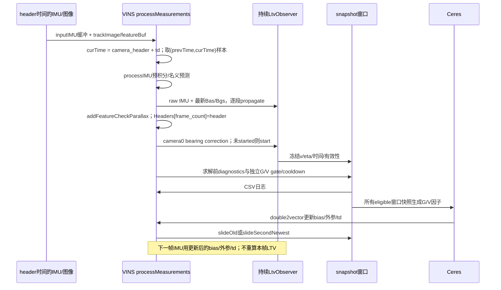

# LTV 第一层观测器交接审计

审计标识：`20261002T131659Z-9661610`。源仓库 `/home/he/vins_fusion_ltv_ws/src/vins_fusion_ltv`，workspace `/home/he/vins_fusion_ltv_ws`，branch `main`，HEAD `9661610dbcf26374e805634fbd4415ecddf7128d`。开始时仅 `?? docs/01_VINS_LTV_HANDOVER_PROMPT.md`，submodule status 为空。本包新增之外保持估计器、配置、旧测试及实验输出只读，未运行 ROS replay、调参、全数据集、提交或 push。文件与依赖哈希见 [SOURCE_MANIFEST.json](SOURCE_MANIFEST.json)。

本报告的 `[论文]` 指本地 ACC 2025 PDF；`[代码事实]` 指上述 HEAD 对应的本地文件，引用采用 `path:line + symbol`；`[工程近似]` 指实现对理论和统计模型的取舍；`[待核实]` 指缺少本次或目标框架证据。文中的源码路径相对仓库根目录，行号不含副本改写。旧实验通过不等于本次重跑。

## 1. 先读结论与偏差

- `[代码事实]` 最小 observer 编译集合只有 `ltv_observer.cpp/.h`、`ltv_types.h` 和 `utility/utility.h`。后者是实际 include，observer 仅调用其头内 `Utility::skewSymmetric`，不需要 `utility.cpp`、ROS、Ceres 或 OpenCV 链接。四个原样只读副本已放入 `source_core/`，逐个 SHA 与原文件一致。
- `[代码事实]` 状态从零开始，并非用 VINS 的姿态、速度、深度播种；正常递推仅从 VINS 获取 bias、相机外参和时差。姿态/速度另用于诊断和 gate；Ceres 可通过优化后的 bias 等影响下一帧，因此跨帧系统不是完全独立的单向传感器。
- `[代码事实]` 相机边界没有 IMU 值线性插值。最后一段用时间在相机边界处或其后的 IMU 样本，截短 `dt`；有条件地使用未来 IMU 值。见 §5。
- `[代码事实]` 基础 YAML `freq=10`，notune/Stage7 产物 `freq=20`；但生产 C++ 没有读取或使用 `freq`。实际 feeding 由输入相机时间和 `multiple_thread` 控制，不能把写入的 `20` 称为运行限频器。见 [配置表](CONFIG_EFFECTIVE_TABLE.md)。
- `[代码事实]` `sanitizeCovariance` 的两处 `P = 0.5*(P+P.transpose())` 没有 `.eval()`，存在 Eigen alias 风险。独立探针非对称 5×5 输入与冻结旧值对称化的最大差为 **9**；同探针的状态传播、P 传播及 camera P correction 与旧值表达式的差均为 **0**。本次没有修改算法。fixture 中 P 最大非对称量约 `1.46e-11`，该小量不证明表达式普遍安全。见 `validation/alias_probe.stdout.log`。
- `[代码事实]` 当前存在注册的 LTV gtest/Python 测试；`AGENTS.md` 的“无 dedicated unit-test suite”描述已过时。`docs/vins_fusion_ltv_plan.md:23` 写 Stage7 未执行，但发布说明、源码与 Stage7 本地产物已经存在。notune 文档把 V_gate 称为 Oracle；本地 runner 与对应 effective config 实际为 **online VelocityQualityGate，Oracle=0**。旧文件均保留。
- `[待核实]` 原始 LTV 文件没有独立 license header，仓库未找到 LICENSE/COPYING 文件，`vins/package.xml:9` 仍是 TODO license。已原样保留 Utility 的 HKUST/GPLv3 header；不能据此替作者补写许可或断言适合目标 OpenVINS 仓库的许可证。公开再分发前需要确认来源授权。

## 2. 状态、输入、输出与持久性

`[论文]` 式 (4)、(10)、(13) 定义第一层状态：

\[
s=[(\ell_1^B)^T,\ldots,(\ell_N^B)^T,v_B^T,\eta_B^T]^T,\quad
\ell_i^B=R_{WB}^T(p_i^W-p_B^W),\quad\eta_B=R_{WB}^Tg_{phys,W}.
\]

`[代码事实]` `vins/src/ltv/ltv_observer.cpp:59 + initializeBaseState`、`:89 + velocityOffset`、`:229 + rebuildState`：

| 项 | 维度/offset（从 0 开始） | 单位/参考系 | 生命周期 |
|---|---|---|---|
| 路标 `ell_i` | 3；slot `j` 的 `3j..3j+2` | m；相对 **body 原点**、body 轴 | 持续递推，ID 离开时删除；不是 camera 原点深度 |
| `v_B` | 3；`3N..3N+2` | m/s；body 原点速度、body 轴 | 不随 VINS 滑窗移动或每帧赋新值 |
| `eta_B` | 3；`3N+3..3N+5` | m/s²；body 轴、物理向下重力 | 自估计；不会每帧用 `R^Tg` 覆盖 |
| `P_LTV` | `(3N+6)×(3N+6)` | 混合状态的**设计矩阵尺度** | 保存全部交叉块；加减点后双方索引一起映射 |
| raw acc / gyro | 各 3 | specific force m/s² / rad/s；body/IMU 轴 | 每个有效 `dt` 的输入，非世界系去重力加速度 |
| accel / gyro bias | 各 3 | m/s² / rad/s；对应 IMU 轴 | VINS 适配器取最新完成状态；observer 内不估计 bias |
| normalized coordinate | 各 3 | camera0 轴；无量纲 | 本帧输入；内核再次单位化，常见为 `[x,y,1]` |
| `R_BC` / `p_BC` | 3×3 / 3 | `x_B=R_BC*x_C+p_BC`；p 为 m | 使用本帧传入值；可以由上轮标定优化更新 |
| 时间 / `dt` | 标量 | s；header 派生 double | 内核累计 IMU 时间；无接收时钟输入 |

`[代码事实]` `vins/src/ltv/ltv_observer.cpp:113 + propagateImu` 接收 **raw IMU 和 bias 分别传入**，先 `omega=gyro_measurement-gyro_bias`，再 `a=acc_measurement-accel_bias`，不进行世界旋转，不额外减重力。式 (10) 的 `+eta+a` 自行组合重力和 specific force。VINS 在 `estimator.cpp:539 + processIMU` 使用 `R*(acc-Bas)-g`，故 LTV 的物理 `g_phys,W=-g_VINS`；gravity factor 在 `estimator.cpp:1438 + optimization` 明确传 `-g`。EuRoC 中 VINS `g=(0,0,+9.81007)`，物理向下为 `(0,0,-9.81007)`。

`[代码事实]` 从 VINS 状态读取的用途如下：

| 读取 | 证据 | 用途 |
|---|---|---|
| `Bas[frame_count], Bgs[frame_count]` | `estimator.cpp:550 + processIMU` | 正常递推去 bias；非初始化、不在 LTV 内保存 bias 状态 |
| `ric[0],tic[0]` | `estimator.cpp:587 + processLtvImage` | 正常 bearing 模型；只用 camera0，忽略 camera1 |
| `td` | `estimator.cpp:390 + processMeasurements`、`:566 + processLtvImage` | 相机对应 IMU 时刻；不是测量残差内重算时间 |
| `Rs[index],Vs[index]` | `estimator.cpp:687/706 + updateLtvFactorDiagnostics` | G/V 诊断；V disagreement 用于在线 V gate |
| `g` | `estimator.cpp:668/687/1439` | gate 模长、方向诊断、G factor 世界重力 |
| VINS landmark/depth | `processLtvImage` 完整实现 `:557` | **没有读取**；观察值只取 camera ID=0 的 `head<3>()` |
| VINS 位姿、速度播种 LTV | `initializeBaseState/start` 完整实现 | **不存在**；全部状态零，P0 为配置的分块对角 |

`[代码事实]` `ltv_observer.h:51 + LtvObserver` 持续保存 config、started 标志、state、P、feature/slot、missed/candidate map、上次 camera/frame/IMU 时间、warmup 连续计数、创新/耗时/子步统计、最近 reset reason。`LtvSnapshot`（`ltv_types.h:91`）是值拷贝，仅保存 v/eta 和诊断；不包含完整 P、gain、landmarks 或 maps。`estimator.cpp:561` 每帧覆盖的是 `latest_ltv_snapshot`/窗口槽，而非 observer 的状态。

`[代码事实]` 内部状态清零路径：构造初值；`configure`→`reset(Reconfigured)`；任何有效 `start`→`reset(None)`；显式 `reset`；IMU 非正/过大 dt、非有限输入；camera 非有限/非法外参、重复/倒退 frame、IMU 时间错配、camera gap；非法状态/谱失败/子步数超上限。`clearState`（`estimator.cpp:109`）清 observer/窗口/cooldown；重配置（`:197`）也清 observer。`start` 即使已经 started 也会清空，调用方必须禁止每帧调用它。没有每帧用 VINS v、eta、landmark 覆盖内部状态的路径。`rebuildState` 仅保留旧状态/交叉块并添加零新点。

`[代码事实]` optimizer 只消费冻结的 `gravity_body`、`velocity_body` 和资格/gate 标志，使用各自 sigma/Huber。`ell_i`、完整 P、gain 不参与 Ceres；创新、P trace/diagonal、substeps 等是诊断，其中 feature 数/创新/eta 模长影响 gate。CSV 中 `factor_added` 是本帧求解前资格，不是所有滑窗 residual 的逐次求解统计。

## 3. 公式与实际 split Euler

完整逐式映射、矩阵维度及非零块见 [FORMULA_CODE_MAP.md](FORMULA_CODE_MAP.md)。核心事实：

\[
\Pi_i=I-b_i^Bb_i^{B T},\quad b_i^B=R_{BC}{z_i^C\over\|z_i^C\|},\quad
y_i=\Pi_i p_{BC},\quad y_i=\Pi_i\ell_i^B.
\]

\[
\dot\ell_i=-[\omega]_\times\ell_i-v_B,\quad
\dot v_B=-[\omega]_\times v_B+\eta_B+a,\quad
\dot\eta_B=-[\omega]_\times\eta_B.
\]

\[
\dot{\hat s}=A\hat s+Ba+K_L(y-C_L\hat s),\quad K_L=P_L C_L^TQ_L,
\quad\dot P_L=AP_L+P_LA^T-P_LC_L^TQ_LC_LP_L+V_L.
\]

`[论文]` 式 (19) 是 (15) 分量展开，三种状态均带创新增益；只有名义动力学不构成完整 observer。论文假设固定 N≥3 地标、每点 PE、连续有界 omega/bearing、Q/V 一致正定及 P0 正定。这里的 `M` 专指本帧有效观测数，**不是论文第二层中已知世界地标数 M**。

`[代码事实]` `propagateImu` 完成 `s += dt*(A*s+B*a)`、`P += dt*(A*P+P*A^T+V)`，每个 IMU 段仅一次；相机不再计算 `AP+PA^T+V`。camera 以当前 C/y 冻结，在实际两个 camera **IMU 对齐时刻**间隔上积分 `q*P*C^T*innovation` 及 `-q*P*C^T*C*P`。首 camera 只管理点/创新/warmup，不 correction；M=0 不 correction，但更新时间并把连续 healthy count 清零。

`[代码事实]` adaptive substeps 计算一次预校正 `rho=max(0,lambda_max(q*C*P*C^T))`，`n=max(1,ceil(camera_dt*rho/safety))`；`n>max_camera_substeps` **reset**，不是 clamp。每步 `h=camera_dt/n`，用本步旧 s/P 计算 innovation 和 `P*C^T`，更新 s，再更新 P，随后谱修复。gain 不单独跨步保存，下步随 P 重算。当前 Eigen3.4/O1 的独立表达式探针支持这三处乘法使用旧值；不能把此证据扩展为所有编译器证明。

`[工程近似]` 这是 operator split、右端 IMU 样本 Euler 与当前 bearing 的整段冻结校正；不是论文给出的离散 Kalman 更新。n 个积分子步是同一视觉测量的数值积分，不能将其当 n 次独立 EKF 更新。更换 RK/离散增益/对称化 `.eval()` 都是改变源行为，需要另开变更、重新定义 parity，不能偷偷夹进移植。

`[代码事实]` PSD 修复的意图是 `S=(P+P^T)/2`；谱分解 `S=U diag(lambda) U^T`；`scale=max(1,max|lambda|)`；`min(lambda)<failure_threshold*scale` 则失败；否则 `lambda'=max(lambda,floor)`，重构后再次对称化并检查 finite（`ltv_observer.cpp:437 + sanitizeCovariance`）。**两处对称化的实际 Eigen 原地求值存在上文 alias 风险，不能宣称精确执行 S 公式**。SelfAdjointEigenSolver 默认读一个自伴三角视图。fixture 保存实际输出，不替换成理想谱修复。

`[工程近似]` Q=`q_landmark*I_(3M)`，V=分块 `v_* I`，P0=各 `initial_p_* I` 是 observer **设计矩阵**。论文的正定/有界性条件不等于统计估计误差模型；`q_landmark` 不应直接叫 bearing 噪声方差，V 不应直接叫 IMU 过程噪声，P 子块也不能直接给 OpenVINS 测量 R。实际 `innovation/sqrt(M)` 单位近似 m（地标投影输出），不是经过协方差 whitening 的统计 NIS。

## 4. 特征生命周期与 compaction

`[代码事实]` `ltv_observer.cpp:161 + updateFeatureLifecycle`：只接受 ID≥0、坐标 finite、norm>1e-12。有效 ID 用 set 去重。candidate_age：每次看见+1；不活跃且未看见的候选擦除；活跃路标漏检期间保留年龄。已活跃 ID 按**旧 slot 顺序**检查，看见→missed=0，未见→+1；保留条件是 `missed<=max_missed_frames`，所以默认 2 允许连续漏 2 帧，第 3 帧删除。删除时擦 missed/age。

`[代码事实]` 新候选按 age 降序、ID 升序排序补到 max_features；无最低年龄门槛，新 ID 可当帧加入；已有路标不因候选更老或“更好”而强制退出。“优先选点”实际只有年龄与 ID，没有几何评分或 VINS 深度筛选。measurement 按 slot 升序确定性堆叠；重复 ID 的有效坐标由 `emplace` **第一个**胜出（`:329`）。

`[代码事实]` `rebuildState`（`:229`）建立每个新标量对应旧索引 `old_index`，保留项令 `s_new[r]=s_old[map[r]]`、`P_new[r,c]=P_old[map[r],map[c]]`。新点状态=0，P 对角=`initial_p_landmark I`，新点与所有旧点/v/eta 的交叉块=0，随后正常递推产生交叉项。不是只保存对角块。

例：旧 `[10(slot0),20(slot1),30(slot2),v,eta]`，删除 20 并加 40 后为 `[10(slot0),30(slot1),40(slot2),v,eta]`。标量映射 `[0,1,2,6,7,8,-1,-1,-1,9,10,11,12,13,14]`。因此 `P_30,v`、`P_10,eta`、`P_v,eta` 等全部按行列映射保留；新 `P_40,*` 交叉块为零。fixture 包含实际漏检、删除中间 slot、compact 与新点事件。

`[工程近似]` warmup 只数**全局连续** `observed_features>=min_features` 的 camera 更新，首帧也计数；不足则清零。达到 warmup 后仅检查 state/P finite，velocity finite，gravity norm 在阈值内。没有单路标收敛标志或最小年龄要求。新点刚加入时 snapshot 仍可能全局 valid，不能据此声称所有新路标已收敛。动态集合/漏检切换不满足原论文固定集合与连续 C 的证明条件。

## 5. 调用顺序、时间与反馈



`[代码事实]` `estimator.cpp:378 + processMeasurements`、`:515 + processIMU`、`:752 + processImage`、`:1362 + optimization`。LTV 只在 NON_LINEAR 状态工作。INITIAL 切换 NON_LINEAR 的**同一图片**此前 LTV 已跳过，下一图片才启动；启动时 reset 并设置相机对应 IMU 时间，前一个区间 IMU 没有补喂。日志在 Ceres 前写，gate 在该帧只冻结一次，后续求解重复使用旧窗口快照，不随优化迭代改变。

`[代码事实]` online image/IMU 都用 header stamp（`rosNodeTest.cpp:108/134/159`）；offline 用缓存整数 ns 转 double（`stage5Replay.cpp:156`）。offset 方向为 `t_imu=t_camera+td`。`getIMUInterval`（`estimator.cpp:330`）先弹 `<=prevTime`，再弹并收集 `<curTime`，追加第一条 `>=curTime` 但留在队列。首样本 dt=sample_time-prevTime；中间 dt=样本差；末样本 dt=curTime-前样本时间。**无 acceleration/gyro 线性插值**，LTV 用该段传来的单条 raw 值；VINS 自身做相邻值 midpoint。这两者不同。

`[代码事实]` 首个缓冲值可能是“未来”边界样本，值被提前用于截短末段，并在下一图片区间再次覆盖其剩余时间；这不是正常情况下重复累计 dt，但不是严格只取过去数据。只有一个区间样本时 `i==0` 优先于末样本分支，dt 会到样本时间而非 curTime；`dt=0` 也会重置 observer。缓冲器要求同步且足够样本，`getIMUInterval` 对空队列/非法区间的额外健壮性未由本次 integration 测试证明。

`[代码事实]` 同帧 feeding 保护依赖 featureBuf 每帧弹一次、IMU 时间按 prevTime 推进、`updateFeatures` frame 必须严格增加。observer 的 `propagateImu` 接口仅给 dt、不接受 sample timestamp/唯一 ID，**没有独立去重保护**；同一 dt 重喂会正常加时间，再由 camera tolerance 可能抓到错配。core 没有 reset epoch 字段，`start` 会覆盖 reset reason 为 None；同一区间发生 IMU reset、随后相机重新 start 后，CSV 可能看不到原 reset reason，cooldown 未必被触发。OpenVINS 适配器应单独记录 epoch/reset 事件，不能把 CSV reset_count=0 当绝无 reset 的证据。

`[代码事实]` `ltv_snapshot_window.h:38 + slideOld` 将每项左移，最后槽复制倒数第二；`:45 + slideSecondNewest` 只把最新赋倒数第二。`estimator.cpp:1837/1872` 与 Headers/位姿同步；最新占位副本下一帧覆盖。observer state/P/feature map **不滑窗**。窗口专用语义不能映射成 OpenVINS clones 或重复 EKF 注入；旧快照仅复用在 VINS 的重求解中。G/V 没有显式添加到 marginalization 的 residual 列表（`estimator.cpp:1611..1801`），但已优化的状态/线性化点和后续 bias 仍会间接受影响，不能说“完全没有历史影响”。

`[代码事实]` CSV `ltv_csv_logger.cpp:69 + write` 用 `max_digits10`（double 为17有效数字），flush 每行；时间 s，耗时 ms，角度 deg，速度 m/s。日志 configure 使用 `ios::trunc`，reset/重新配置可能重开截断旧日志。double epoch≈1.4e9s 分辨率约0.24µs，17位输出只保留已有 double 精度，不恢复 ns 原值。Oracle 用 `llround(t*1e9)` 精确查键，有独立精度风险；不迁移 Oracle。

## 6. G/V 因子与 OpenVINS 差异

`[代码事实]` `ltv_gravity_factor.cpp:33 + computeResidual`：

\[
r_g={R_{WB}^T(g_{phys,W}/\|g_{phys,W}\|)-\hat\eta_B/\|\hat\eta_B\|\over\sigma_g},
\quad\sigma_g=\text{gravity_sigma_deg}\,\pi/180.
\]

G 用三维单位方向差（模长 `2 sin(theta/2)`），不是逐维欧拉角或 acos 残差，scale 与位移无关；sigma 参数用 rad 作方向差权重，小角度才近似角误差。局部右扰动导数 `H_theta=[direction_prediction]_x/sigma`，位置零。`Evaluate:58` 返回 row-major 3×7：cols0..2=0，cols3..5=局部导数，col6=0。

`[代码事实]` `ltv_velocity_factor.cpp:30 + computeResidual`：

\[
r_v={R_{WB}^TV_W-\hat v_B\over\sigma_v},\qquad
H_\theta=[R_{WB}^TV_W]_\times/\sigma_v,\quad H_V=R_{WB}^T/\sigma_v.
\]

V sigma 为 m/s，3×7 pose 与 G 同布局；3×9 SpeedBias Jacobian cols0..2=H_V，其余 bias 列0。SpeedBias 是 `[V_W,Ba,Bg]`（`estimator.cpp:1265`），pose `[p_x,p_y,p_z,q_x,q_y,q_z,q_w]`；四元数 Eigen Hamilton 表示 R_WB。

`[代码事实]` `pose_local_parameterization.cpp:12 + Plus` 用 `q_plus=(q*deltaQ(theta)).normalized()`，右乘 Hamilton；`PlusJacobian:30` 返回 top6 identity、last row0。该 3×7 写法配合此人工局部布局，**不是归一化四元数 ambient 解析导数**。Minus/MinusJacobian 同为 VINS 兼容实现。两个因素独立 `HuberLoss(delta)` 作用在 sigma 已缩放的 residual norm 上；delta 默认2，单位是加权 residual 标度。打印的 before/after cost 是 `0.5||r||²`，没调用 Huber rho，不是鲁棒总代价。

`[代码事实]` G gate 检查 base、features、`abs(||eta||-||g||)`、`innovation/sqrt(max(1,M))`、reset cooldown；负创新阈值禁用此条件。V gate 再检查 `||v_LTV-R^TV_VINS||`，与 Oracle 互斥，非法 V gate 配置 fail closed。**非法 G gate 配置在 setParameter 被 disable，G factor 若仍开会退回 base eligibility，无 gate 安全保证**（`estimator.cpp:166/619`）。同帧诊断不回写 observer。G/V cooldown 独立；没有形式化安全认证。

迁移必须遵守：

```text
VINS Ceres 本地 G/V residual = prediction - measurement。
OpenVINS EKF innovation = measurement - prediction。
OpenVINS 所需 H = prediction 对其误差状态的导数。
不能仅复制 residual、翻符号或复制 3×7 Jacobian。
```

`[待核实：目标版本]` 官方 OpenVINS 文档说明世界到 IMU 旋转、JPL 左乘误差，以及 `[q,p,v,bg,ba]` 顺序；本任务没有目标工作空间/HEAD，必须重新读目标源码确认。参见 [OpenVINS propagation](https://docs.openvins.com/propagation.html)、[JPLQuat](https://docs.openvins.com/classov__type_1_1JPLQuat.html)、[IMU state](https://docs.openvins.com/classov__type_1_1IMU.html)。对每个目标状态块重新推导 H、FEJ、创新/噪声、时间与 G/V 联合相关性，不把 VINS SpeedBias 顺序照搬。Clone 一般是历史 pose，不应假设存在同刻 velocity；优先明确同一物理时刻的 current IMU state，禁止取“最接近 clone”拼 velocity。

## 7. 最终生效配置与实验口径

完整 `key / 类型 / 单位 / 默认 / base / notune / T2 / 覆盖来源 / 使用位置` 在 [CONFIG_EFFECTIVE_TABLE.md](CONFIG_EFFECTIVE_TABLE.md)。原始读取采用 OpenCV FileStorage，缺 key→`LtvConfig{}` 默认，不是 ROS 参数逐项 override。`parameters.cpp:72 + readLtvConfig` 解析全部 43 个 LTV 字段；observer `configure` 另 clamp feature 数、warmup、missed、Euler safety/substeps；Estimator 单独验证 factor/gate。

`[代码事实]` Stage6 规则 `base YAML→FROZEN_SETTINGS→MODES→output/debug paths`；Stage7 在 MODES 前用六维白名单候选替换 frozen 数值；Stage7 CLI 选择 config/cache/replay/output/dry-run，没有任意 LTV 参数 CLI（`run_stage7_tuning.py:49/449`）。Stage6 `--preserve-config-frequency` 仅删除 freq 覆盖（`:336/370`）。effective YAML 是 evidence，仍需查源码使用位置，不能仅凭文件宣称全 key 生效。

`[代码事实]` 本包取 Stage7 **T2 / V1_01_easy / 主 trial** 的 runtime/effective/input_manifest/validation 及 notune baseline/joint 配置原样备份至 evidence。Stage7 runtime 是 partial 输出路径；发布后 effective 改成最终路径，算法字段相同，两个 SHA 本来就不同。发布 live effective 也备份，方便区别启动配置。这里的“当前实验”指明确的 T2 发布批次，不宣称所有 `/home/he/output` 目录或后台进程使用同一参数。

`[代码事实：历史产物，未重跑]` notune unified 批次 11×5=55 运行，B=passive observer、G/V 因子关闭；replay SHA `3c7ede1ae43be48305f11d8a33b034750ed651ca5e8b8e6c25fe5320aaa4afed`。notune manifest 没有足够 source commit/dirty 全量源码证据，**不能反推当前 HEAD**。Stage7 plan/trial 记录 source commit `6c699a4333b052cb0b3d86fb9cf57474349fe967` + 非空 dirty status/diff SHA，并非 clean 当前 HEAD；replay SHA `779da8043e36a5bed374fe28985158bd8827e29180abde78886d2f9fc54a3464`，本次对现有二进制只算 SHA，确实相同，不执行它。历史 dirty 文件完整内容未随 manifest 保存，不能用 diff hash 声称精确重建整个历史源码。

`[代码事实：历史报告]` Stage7 T2 只把 G normalized innovation 从0.05改0.03；G eta误差0.2m/s²、sigma10°，V sigma1m/s、创新0.03m、disagreement0.5m/s，其他固定值不变。J 是各序列相对同批 B 的 ATE变化等权平均，W0=-2.8649%，T2=-3.1054%；绝对 ATE 均值 **比 W0 增加0.1707%**，最坏序列相对 W0 +6.2554%。EuRoC 是调参集，不能称 held-out 泛化。

`[代码事实：评价器口径]` ATE 用各模式独立无scale SE(3) 对齐；rotation/velocity 使用共同 B 对齐旋转、官方 GT CSV velocity、共同匹配时刻。Stage7共同支持集的选参结果不能与旧每模式独立姿态对齐结果混算。旧 stage_test_result/plan 中不同阶段 B 保持历史含义；只与对应 binary/config/evaluator 比较。本次未重评任何真实轨迹，也未重做 ROS/RViz 验收。

## 8. 验证证据与局限

实际执行命令/退出码/stdout/stderr 见 [validation/results.json](validation/results.json)，逐条测试清单见 [TEST_EVIDENCE.md](TEST_EVIDENCE.md)。独立 `/tmp/ltv-handover-build-*` 编译，生产 build/install 不受影响：33 项现有 C++ LTV 测试 + 59 项 Python 小测试通过，相关编译 stderr 无 warning。未进行完整 ROS ament build/ctest、节点启动或数据集 replay；不存在“本次全系统通过”的结论。

源 observer 原样运行生成 [parity_fixture](parity_fixture/README.md)：固定解析输入、非零角速度与双 bias、非单位外参旋转/平移、正常多次 correction、warmup、漏检/中间删除/加点、无观测、容差/重复 frame/gap、显式 reset、非法 dt、substep 上限。每个事件保存实际 state/v/eta、feature slot、完整 P、子步和 reset 原因，不比较 wall time。C/y/A/B 是 harness 按相同公式重建的说明矩阵，**不是内核新增 accessor 输出**；golden state/P 全部来自源实现。最终源构建与副本构建字节一致；初版亦重复运行一致。这只证明本机本编译配置的确定性。完整输出finite/谱数值检查见 `validation/fixture_numeric_check.json`。

`[工程近似/待核实]` 仍不能由这些测试证明：动态集合 PE/GES；真实噪声下统计一致性；LTV 与宿主共享数据的交叉相关性；G/V 作为独立伪传感器的可信 R；所有时差/丢帧/在线重新标定条件；alias 在所有编译器下的数值效果；gate 安全或迁移后的 ATE 改善。q/V 的仿真量级不能保证实机收敛。global warmup 不是单点可靠性。目标 OpenVINS 版本与许可适配仍需确认。

## 9. 给 OpenVINS Codex 的执行边界与第一次测试

1. **可直接复用的最小集合**：本包 `source_core/vins/src/ltv/{ltv_observer.cpp,ltv_observer.h,ltv_types.h}`、`source_core/vins/src/utility/utility.h`；保留原路径/内容/header，先以 C++14 + Eigen 原样编译。只需要 `Utility::skewSymmetric`，之后有授权的独立变更才考虑剥离数学函数与修正 alias。
2. **必须适配的输入约定**：raw specific force/gyro + 不重复去除的最新 bias；明确 body/IMU轴及标定；`x_B=R_BC*x_C+p_BC`、camera0单位 bearing、持续唯一feature ID；相机对应 IMU时刻/offset方向/边界处理；每个区间仅喂一次；只在新 epoch 初始化 observer；独立日志/gate与snapshot时间。
3. **G/V 辅助需要重新推导**：世界到 body旋转、JPL左乘误差状态、prediction导数H、measurement-prediction innovation、rank2方向更新、R/交叉相关性/联合更新顺序、FEJ与current/clone匹配。Ceres因素仅供核对物理量，禁止直接复制3×7 Jacobian或将P赋measurement R。
4. **已验证**：最小核心不需ROS/Ceres/OpenCV链接；原样副本SHA；既有LTV公式/局部factor Jacobian/gate/window测试；本次小fixture的状态维度、生命周期、warmup/时间失败行为及确定性；独立alias风险复现。
5. **未验证/未解决**：目标源码约定及许可、跨平台数值容差、源symmetrization alias修正、真实统计协方差与共享数据相关性、动态集合稳定性、目标ATE/安全收益及全链路运行。
6. **第一次必须先跑**：用 [inputs.jsonl](parity_fixture/inputs.jsonl) 逐事件喂源副本，按 [compare.py](parity_fixture/compare.py) 比较实际 state/v/eta/P和slot/reset/substeps；再用目标适配器对相同输入做同样比较。先关G/V并保留原惯性预测，完成时间/bias/extrinsic/reset parity，之后才设计可独立关闭的G/V辅助。禁止移植第二层pose observer、OpenVINS landmark update、VINS滑窗/Oracle/marginalization/ROS replay。
